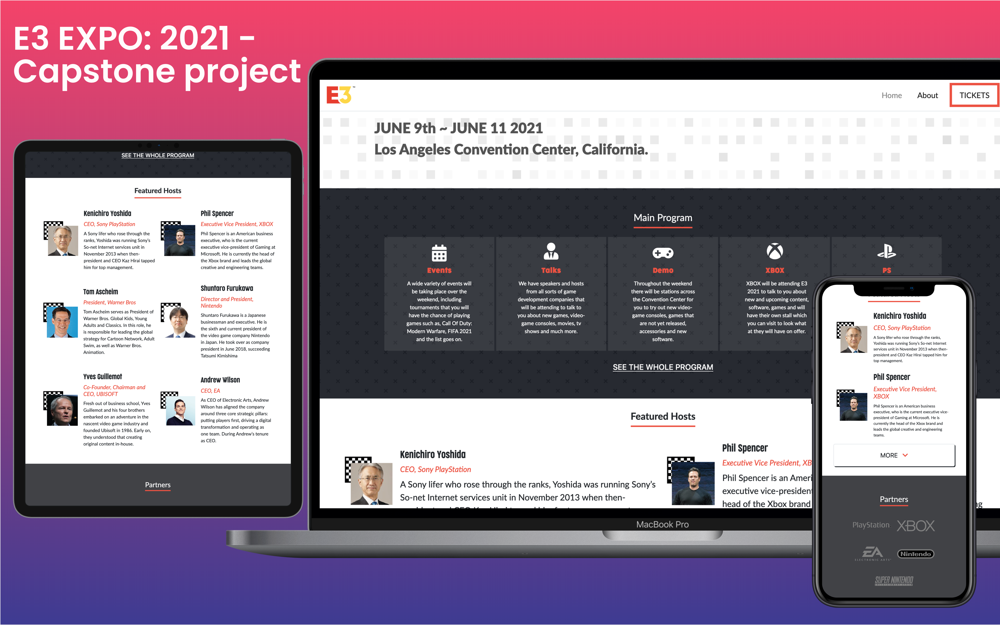
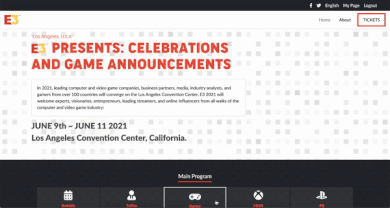

# HTML/CSS Capstone: E3 2021 Conference

## Library Directory
 
| Contents        |
| ------------- |
| [Built With](#built-with) |
| [Live Demo](#live-demo) |
| [Run Tests](#run-tests) |
| [Authors](#authors) | 
| [License](#license) | 

## Description
> In this project I created a website that includes 3 pages for E3 Expo: 2021.


 

This is my final project of the HTML/CSS module and the task was to create a website consisting of 3 pages and to build off a design that was provided to me. I was asked to build a website that of a conference that takes place so I chose to do 'E3: EXPO'. 

If you have a look around and resize the pages, you will see how the page reacts and is placed in it's different positions. <b> There are 3 pages, 'Home', 'About' and 'Tickets'. </b>

The design that was given to me was designed by <a href="https://www.behance.net/adagio07"> Cindy Shin </a> and the design that I was given is <a href="https://www.behance.net/gallery/29845175/CC-Global-Summit-2015"> here </a>

## Built With
```
- HTML5 
- CSS3
- SASS
- Bootstrap
- JavaScript
- VS Code
- Font Awesome Icons
```

 

 
 

<!--


 -->

## Live Demo

#### Click on the image below..

<a href="https://e3-expo.vercel.app/" target="_blank">
    
</a>

## Run Tests

### Install
```
npm i
```
### Run
```
npm test
```


## Authors

### 👨‍💻 Daniel Ronan
<!--
 [@DcRonan](https://github.com/DcRonan) <br>
 [Daniel Ronan](https://www.linkedin.com/in/danronan10/) <br>
 [@dc_ronan](https://twitter.com/dc_ronan) <br>
 <a href="mailto:danielconnorronan@gmail.com?subject=Hi Dan!"> Email me</a> -->
[](https://github.com/DcRonan) <br>
[](https://www.linkedin.com/in/danronan10/) <br>
[](mailto:danielconnorronan@gmail.com) <br>
[](https://twitter.com/dc_ronan)

### 🤝 Contributing

Contributions, issues and feature requests are welcome!

Feel free to check the [issues page](enter issues url here).

### Show your support

Give a ⭐️ if you like this project!

### Acknowledgments

- Hat tip to anyone whose code was used
- Inspiration

### License


